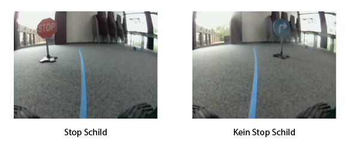
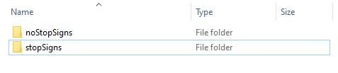
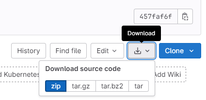
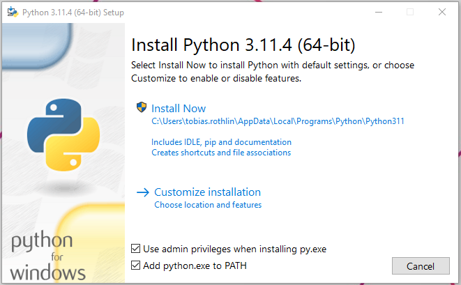
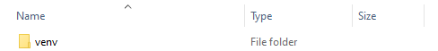
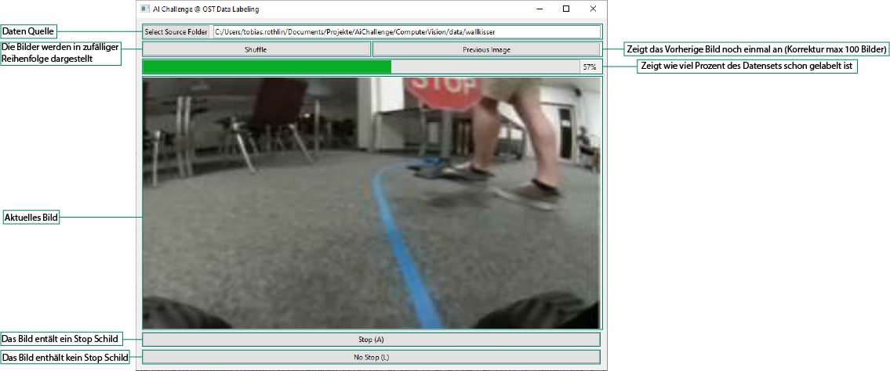

# Bilder Labeling

Hier findest du eine Software, welche es ermöglicht, die aufgenommenen Bilder für das Training der Stoppschild-Erkennung zu labeln. Das bedeutet, diese in zwei Klassen, nämlich in "Stoppschild" oder "Kein Stoppschild" aufzuteilen:



Die Bilder werden in folgender Ordnerstruktur abgelegt:



Neben dem Labeln, übernimmt die Software auch gerade noch die Funktion, alle Bilder auf die richtige Grösse von 120x160 zu verkleinern.

## Installation der Labeling-Software

### Software herunterladen

Gehe auf dieser Seite oben auf Download und lade das Repository als ZIP herunter. Entpacke das ZIP auf deinem Laptop und öffne den Ordner



### Python installieren

> Falls du Python schon installiert hast, öffne die Konsole deines Betriebssystemems (z.B. PowerShell in Windows) und prüfe mit `python --version` (Mac/Linux `python3 --version`), ob die Version grösser 3.6.x ist. Wenn ja, fahre mit dem nächsten Abschnitt "Erstellen der virtuellen Umgebung" fort.

Lade die neueste Python-Version (3.11.x) von der [Python-Website](https://www.python.org/downloads/) herunter und installiere diese. Windows: Achte darauf, "Add python.exe to PATH" auszuwählen!



### Überprüfen der Installation

Überprüfe mit dem Befehl `python --version` (Linux/Mac `python3 --version`), ob Python installiert ist und welche Version angezeigt wird.

### Erstellen der virtuellen Umgebung

1. Öffne die Konsole deines Betriebssystemems (z.B. PowerShell in Windows)
2. Stelle sicher, dass du dich im `bilder-labeling/` Ordner befindest, welcher du heruntergeladen und entzippt hast
3. Führe folgenden Befehl aus:

Windows:
```cmd
python -m venv venv
```

Mac/Linux:
```cmd
python3 -m venv venv
```



### Aktivieren der virtuellen Umgebung

Aktiviere die virtuelle Umgebung

Windows:
```cmd
venv\Scripts\activate
```

Mac/Linux:
```cmd
source ./venv/bin/activate
```

### Installieren der Bibliotheken

Installiere die benötigten Bibliotheken aus der `requirements.txt` mit:
```cmd
pip install -r requirements.txt
```

## Starten der Labeling-Software

Starte die Labeling-Software

Windows:
```cmd
python ./src/main.py
```

Mac/Linux:
```cmd
python3 ./src/main.py
```

Ein neues Fenster sollte sich öffnen.

## Bedienung der Software



### Datenquelle

Die Datenquelle legt fest, von welchem Ort aus die Bilder geladen werden sollen. Der angegebene Ordner sollte die heruntergeladenen Ordner vom Auto enthalten.

Ein Beispiel befindet sich im Ordner `sampleData/`:


